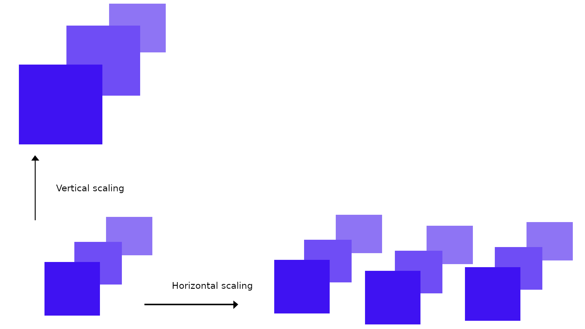
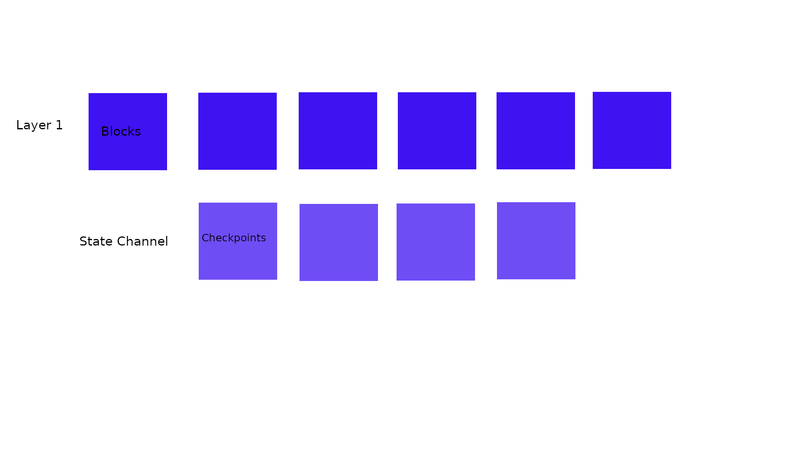
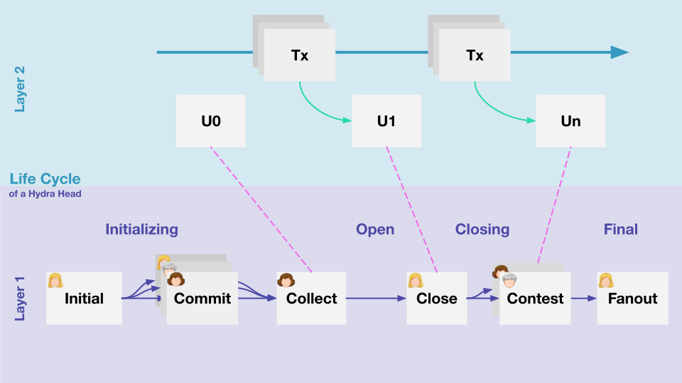
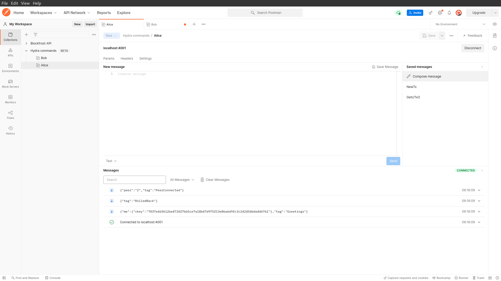

### **Disclaimer**: this document is written in October 2023, the current version of hydra-poc may differ from the description below. The goal of this document is to be educational. For a more updated view on hydra, see the <a href="https://hydra.family/head-protocol/">documentation</a>.

# <a href="https://eprint.iacr.org/2020/299.pdf">Hydra: Fast Isomorphic State Channels</a> 
<details>
<summary><b><h1 style="display:inline">1. Intro</h1></b></summary>
<p> <br>
In this document, we will discuss the current implementation of the Hydra proof of concept implementation. This decentralized application aims to create a fast isomorphic state channel on the Cardano blockchain. What this precisely means will be discussed later. Before we start, we will provide some context to further build upon. After that, we will summarize the Hydra protocol in more detail.
</p>

*   <details>
    <summary><b>1.1	Context</b></summary>
    <p>
	Any layer one blockchain suffers from a fundamental scalability limitation, this is fundamental because intentionally, transactions on a blockchain are validated by multiple parties to enhance the security of the protocol, this just consumes more time. For Cardano, this is reflected in the fact that blocks are created on average each 20 seconds, in this time, block creation, propagation, and validation happens. These limitations ultimately mean that state, the information that describes the system, can only change in discrete steps of this duration. Besides, given peak hours on the blockchain when there is a transaction queue, the time required to settle and confirm a transaction might also be higher, further increasing the effective settlement time. This because your transaction might not be added to the next block, but the second or even third one coming.
	</p>
	</details>

*   <details>
	<summary><b>1.2	On scaling, sidechains and state channels </b></summary>
	<p>
	In general, not specific to blockchains, computer science knows two common ways of scaling systems, they are <b>vertical</b> and <b>horizontal</b> scaling. Both try to increase resources available to a system to achieve better overall performance. <br>

	For vertical scaling, the performance of the system is increased by adding resources available to the already existing instance of the system. For Cardano, this practically means, increasing the block size to allow for more actions in each 20 seconds for the layer one blockchain. This is a great way to initially scale the system, but is always capped by some physical limits. This limit is the diffusion time of a block, to ensure the security of the system each block has roughly 5 seconds to propagate and diffuse among the other network participant so that they can build another block on top of it. <br>

	Then we have horizontal scaling, here the performance of the system is increased by adding more instances of the same system alongside each other. Practically, this means that besides the main chain one or multiple side chains are spun up that do the same thing, each "x" seconds all instances create a block. Unlike horizontal scaling, vertical scaling does not know a limit, there can be many side chains that are connected to the layer one. A downside to this way of scaling is that this abstract notion of "state" is cut into multiple pieces. Each instance is blind to what is happening on the other instances, and crossing to another instance requires a bridge (the state is sharded). <br>

	 <br>

	Now there is a third way of scaling blockchains, this is via state channels, of which Hydra is a flavor. State channels, similar to the horizontal scaling solution, are a layer two solution that runs separately and alongside the layer one, thought the two are different! <br>

	At its core, a state channel in the context of blockchains is a smart contract that enforces a set of predefined rules for transaction handling between parties. Unlike in the horizontal scaling case, where multiple instances of a blockchain are run at the same time, a state channels originates from the main chain and eventually merges back in the main chain, it lives only temporally (though it could exist indefinitely). <br>

	The goal of these state channels is to take some pieces of state on the layer one blockchain and validate its progress else where between only those parties whom are concerned about this state. Then, after this computation is done, the parties return the final state on which all parties agree back to layer one. This construction means that the 20-second time duration of block production no longer pose a problem for the propagation of the state in a state channel. Moreover, parties that run a state channel could agree on not charging any transaction fee for these computations! <br>

	The security of the state channels lies in the hands of the parties that run the channel, similar to a blockchain. But there is a difference, instead of blocks, the progress is captured in snapshots. These snapshots are intermediate captures of the state of the channel and are signed by each party in the channel. When the channel closes, each party has a chance to return their last perceived state. In case of dispute, the main chain can always verify the latest snapshot, which contains all signatures of the participants and a timestamp. Thus, with each transition in channel, cryptographic proof is gathered, and in case of dispute, the layer one blockchain is leveraged to settle that dispute. A visual representation <br>

	
	</p>
	</details>

*   <details>
	<summary><b>1.3	Hydra as a state channel</b></summary>
	<p>
	Hydra is a flavor of a state channel, but it is more. That is because it is an isomorphic state channel, this is a technical term that indicates that the link between the main chain and the hydra channel is structure preserving. The ledger rules that apply to the main chain also apply to the state channel. This is handy because with this preservation, smart contract written for the layer one can also be executed similarly in the state channel, they behave the same. <br>

	The origin of the name comes from a mythical serpend-like water monster with multiple heads in Greek mythology. Now that we know what a state channel is, we can see the connection to this monster. Since state channels can be run concurrently, that is, multiple channels can be run alongside each other asynchronously, a blockchain can have multiple "heads" as well.
	</p>
</details>
</details>

<details>
<summary><b><h1 style="display:inline">2. Protocol outline</h1></b></summary>
<p><br>
In this section, we will discuss a high-level overview of the different stages of the Hydra protocol and its life cycle. We assume that everything goes accordingly, by which we mean that during all steps  of the protocol, all parties are online and do not have a dispute. The cycle can be defined in the following four stages.
</p>

*   <details>
    <summary><b>1. Initializing</b></summary>
    <p>
	In this stage, the foundation of the protocol is laid. It all starts with a group of parties that together want to run an instance of a hydra head. A few things need to be determined before they can start a secure execution of the protocol. <br>
		
	Firstly, the parties need to communicate some basic things with each other. They each share the following things

    * An IP address + port of their machine that will run the Hydra node.
    * A Hydra verification key to identify them in the head.
	* A Cardano verification key to identify them on the blockchain.
	* The protocol parameters that they want to use in the Hydra head. 

	<br>
	The IP address and the port is needed so that other parties know how to establish a secure pairwise communication channel with each other. We leave out here what a secure connection entails. The two keys are needed to ensure that parties are cryptographically identified on the blockchain and in the Hydra head. And lastly, all participants need to reach an agreement on the used protocol parameters that will be used inside the head. More details will follow on all these four things. <br>

	Then, once each of the parties has the above information about the other parties, they each can start their Hydra node. This will establish a communication channel for the rest of the protocol execution. <br>

	Via this communication channel, one party can start the protocol by posting an **initialize** transaction on the blockchain. This transaction is made to a smart contract that keeps track of the identification keys describes above of the parties. This party also notifies, via the secure communication channel, the others that this happened. The other parties can confirm this onchain and use this contract to join the protocol. They join by **committing** funds that they have to this contract. Here, the contract keeps track of what funds were put in by which party by linking the funds to their verification key. This in case that the protocol is aborted before the head is opened. <br>
	</p>
	</details>

*   <details>
    <summary><b>2. Open</b></summary>
    <p>

	In this stage, the core of the protocol, which gives us the scalability properties, is run. After all parties have committed to the contract, any party can post a transaction on the blockchain to open the head. To do so they **collect** all the funds committed and combine them in the contract, the head is now open. <br>

	From this point, the committed funds by each party are represented in the hydra head as the initial snapshot. Remember that Hydra is an isomorphic state channel, this means it behaves and looks similar to the layer one blockchain. That is why these snapshots keep track of the state using the EUTxO model. More explicit, each snapshot consists of at least these things

	* a number to indicate its order with respect to other snapshots.
	* a commitment to a collection of UTxO's that represent the state of the head.
	* The signatures of all parties.

	<br>
	With each new transaction, the collection of UTxO's changes and a new snapshot is made. The time that it takes to perform this snapshot is dependent on the size of the UTxO collection, the number of parties in the head and their communication time. But not that this time is certainly less than the 20 seconds per block. Also, not the entire UTxO's collection is stored in the snapshot, since this might get gigantic. The commitment to a particular collection is stored instead, this is done via Merkle tree's, a computer science data structure that allows you to prove that a UTxO is part of the commitment without storing it in full.
	</p>
	</details>

*   <details>
    <summary><b>3. Closing</b></summary>
    <p>
	In this stage, the parties are done with their transactions in the head and want to close it. During the previous stage, they all gathered multiple ordered snapshots, each index by an increasing number. With these, any party can close the head at any time, they do this by making a transaction on the layer one blockchain that notifies the contract that they want to close the head. More detailed, they notify the contract of their last perceived known snapshot. The other parties see this transaction happen on the blockchain and check with the snapshot number that this snapshot is also their last perceived snapshot. If not, they have some time to contest to that snapshot by providing a newer snapshot. The time they have is given as a parameter in the initialization phase.<br>

	Notice that no party can cheat and can publish an old snapshot, as any of the other parties can contest to that intermediate snapshot.
	</details>

*   <details>
    <summary><b>4. Final</b></summary>
    <p>

	In this stage, the head is closed, but the initial funds are still at the contract. To distribute the funds, the contract need to **fanout** the snapshot. From the latest snapshot, the commitment to a collection of UTxO's can be extracted. Each party can use this Merkle tree data structure to prove that an UTxO is part of it. The contract allows them to extract it from the contract to the associated address that corresponds to that UTxO.

	As a concluding overview, the four stages above give the following diagram.

	
	</p>
	</details>
</details> 

<details >
<summary><b><h1 style="display:inline">3. Proof of concept</h1></b></summary>
<p><br>
In this section, we will showcase the usage of the <a href="https://github.com/input-output-hk/hydra-poc">proof of concept</a> implementation of the hydra protocol. The documentation for this implementation can be found <a href="https://hydra.family/head-protocol/">here</a>. Below we will show detailed usages of the main components, these consist of the Hydra node and the usage of the associated API it exposes.
</p>

*   <details>
    <summary><b>2.1	Preliminaries</b></summary>
	Before we start, we will use some tools that are assumed to be installed. These are
	<ol>
		<li>Nix (with the correct IOG nix caches setup)</li>
		<li>Postman</li>
	</ol>

	Here we will use Nix to build the software and Postman will be used to connect to the Hydra API Web Socket. Also, before we start using the proof of concept, we will set up a cardano-node connected to the preview testnet. Every Hydra node needs a connection to the network to verify and post onchain transactions in a trustless way.<br></br>
		
	To start, we clone the hydra-poc repository using

	```
	git clone https://github.com/input-output-hk/hydra-poc
	```

	Change directory to the `hydra-poc` repository and perform checkout to release 0.8.0

	```
	git checkout 0.8.0
	```

	Then enter a nix shell using

	```
	nix-shell
	```

	This shell also brings a `cardano-node` and `cardano-cli` in scope of our path. Then we make a directory for the preview testnet in the repo with

	```
	mkdir preview-testnet
	mkdir preview-testnet/db
	cd preview-testnet/
	```

	Then download the environment configurations for this testnet via

	```
	wget https://raw.githubusercontent.com/input-output-hk/cardano-world/master/docs/environments/preview/alonzo-genesis.json
	wget https://raw.githubusercontent.com/input-output-hk/cardano-world/master/docs/environments/preview/byron-genesis.json
	wget https://raw.githubusercontent.com/input-output-hk/cardano-world/master/docs/environments/preview/shelley-genesis.json
	wget https://raw.githubusercontent.com/input-output-hk/cardano-world/master/docs/environments/preview/config.json
	wget https://raw.githubusercontent.com/input-output-hk/cardano-world/master/docs/environments/preview/topology.json
	```

	You can start the node with the command

	```
	cardano-node run +RTS -N -A16m -qg -qb -RTS --topology ./topology.json --database-path ./db --socket-path ./node.socket --host-addr 0.0.0.0 --port 6000 --config ./config.json
	```

	Keep this terminal running and open another terminal in the `hydra-poc` repository. Again we enter a nix-shell with

	```
	nix-shell
	```

	Once we are in this shell, we export the location of the cardano-node socket with

	```
	export CARDANO_NODE_SOCKET_PATH=/full/path/to/hydra-poc/preview-testnet/node.socket
	```

	This will let our system know where the entry point for communication with the node resides, this is necessary for other programs that will utilize the node. We will also use the following command to add auto-completion of the client to our path
	```
	source <(cardano-cli --bash-completion-script cardano-cli)
	```
	To check the synchronization process of the node, we query the tip of the local known blockchain data

	```
	cardano-cli query tip --testnet-magic 2
	{
  		"block": 337207,
    	"epoch": 84,
    	"era": "Babbage",
    	"hash": "19b809bc1cb6ee28d6f6d004e2f311c26c26fb364ffb9bffa2821e00c3aae98a",
    	"slot": 7307855,
    	"syncProgress": "100.00"
	}
	```
	We see that we are fully in sync with the network.

	</details>

*   <details>
    <summary><b>2.2	Setting up the Hydra nodes</b></summary>
    <p>

    To showcase the protocol, we consider a minimal setup of two participants that together want to open a hydra head, call these two Bob and Alice. To start, we enter a nix-shell in the `hydra-poc` repo and create a directory to hold some setup files.

	```
	mkdir test-head
	mkdir test-head/Bob
	mkdir test-head/Alice
	```

	Then we create for both participants a Cardano key pair and calculate its associated address. We do this with

	```
	cardano-cli address key-gen --verification-key-file test-head/Bob/BobCardano.vk --signing-key-file test-head/Bob/BobCardano.sk
	cardano-cli address build --payment-verification-key-file test-head/Bob/BobCardano.vk --testnet-magic 2 --out-file test-head/Bob/BobCardano.addr
	```
	and

	```
	cardano-cli address key-gen --verification-key-file test-head/Alice/AliceCardano.vk --signing-key-file test-head/Alice/AliceCardano.sk
	cardano-cli address build --payment-verification-key-file test-head/Alice/AliceCardano.vk --testnet-magic 2 --out-file test-head/Alice/AliceCardano.addr
	```
	Next we fund the wallets of Alice 
	```
	cat ./test-head/Alice/AliceCardano.addr
	```
	via the preview testnet <a href="https://docs.cardano.org/cardano-testnet/tools/faucet">faucet</a>. You can check the balance of this address via
	```
	cardano-cli query utxo --testnet-magic 2 --address $(cat ./test-head/Alice/AliceCardano.addr)
	```
	We use can use the following script to split these funds with the wallet of Bob.
	```
	#!/usr/bin/env bash

	fullInput=$(cardano-cli query utxo --testnet-magic 2 --address $(cat ./test-head/Alice/AliceCardano.addr) | tail -n 1)
	inputTxRef=$(echo $fullInput | awk '{print $1}')
	inputTxId=$(echo $fullInput | awk '{print $2}')
	inputValue=$(echo $fullInput | awk '{print $3}')

	cardano-cli transaction build --babbage-era --testnet-magic 2 \
		--tx-in $inputTxRef#$inputTxId \
		--tx-out $(cat ./test-head/Bob/BobCardano.addr)+$(($inputValue / 2))\
		--change-address $(cat ./test-head/Alice/AliceCardano.addr) \
		--out-file ./test-head/splitTx.tx

	cardano-cli transaction sign --testnet-magic 2 \
 	      	--signing-key-file ./test-head/Alice/AliceCardano.sk \
  	     	--tx-body-file ./test-head/splitTx.tx \
   	    	--out-file ./test-head/splitTx.signed

	rm ./test-head/splitTx.tx

	cardano-cli transaction submit --testnet-magic 2 \
		--tx-file ./test-head/splitTx.signed

	rm ./test-head/splitTx.signed
	```
	We can check the balance of both addresses with
	```
	cardano-cli query utxo --address $(cat ./test-head/Alice/AliceCardano.addr) --testnet-magic 2
	cardano-cli query utxo --address $(cat ./test-head/Bob/BobCardano.addr) --testnet-magic 2
	```

	Next we will mark some funds at each address so that the hydra-node can use these to pay for the hydra transactions and make sure that these are not committed in the head. Besides preventing having no funds left to close the head or contest to a false checkpoint, it also acts as the fuel for other stages of the protocol. These commands and script will make an output with a specific datum that the hydra node recognizes as fuel. Before we use the script make sure that `jq` is in your path, if not use
	```
	nix-shell -p jq
	```
	Then for the script use
	```
	export CCLI_CMD=$(which cardano-cli)
	./sample-node-config/gcp/scripts/fuel-testnet.sh ./preview-testnet/ ./test-head/Alice/AliceCardano.sk 4900000000
	./sample-node-config/gcp/scripts/fuel-testnet.sh ./preview-testnet/ ./test-head/Bob/BobCardano.sk 4900000000
	``` 
	This will mark about 100 ada as fuel for transactions hydra related. The other funds can be committed to the head.

	Now we are going to set up the Hydra keys for the two parties. We can do this via the `hydra-tool` executable. Before we use this, we build this tool along with the `hydra-node` package with 
	```
	cabal build hydra-tools
	cabal build hydra-node
	```
	This can take some time. Then we can use
	```
	cabal exec hydra-tools -- gen-hydra-key --output-file ./test-head/Alice/AliceHydra
	cabal exec hydra-tools -- gen-hydra-key --output-file ./test-head/Bob/BobHydra
	```
	We see the creation of the files `AliceHydra.sk` and  `AliceHydra.vk` (similar for Bob). These are the cryptographic key pairs that sign each snapshot. 
	
	We still need one thing, to spin up the two hydra-nodes, that is the protocol parameter that we will use in our test head. We will use the protocol parameters that are the same on the testnet, but with no fees! We copy them from the `hydra-poc` directory with
	```
	cp hydra-cluster/config/protocol-parameters.json ./test-head/protocol-parameters.json
	```
	As stated in the protocol outline, we need these four things to initiate the communication of a head

    * An IP address + port of their machine that will run the Hydra node.
    * A Hydra verification key to identify them in the head.
	* A Cardano verification key to identify them on the blockchain.
	* The protocol parameters that they want to use in the Hydra head. 

		<br>
	Which we have set up above, now we can start a hydra node for each party. We assign Alice the localhost address `127.0.0.1:5001` and Bob `127.0.0.1:5002`.
	
	Next we open two terminals and enter a nix-shell for each from the `hydra-poc` directory. Then use the following command to launch a hydra-node for Alice
	```
	cabal exec hydra-node -- \
		--node-id 1 --port 5001 --api-port 4001 \
  		--peer 127.0.0.1:5002 \
  		--hydra-signing-key ./test-head/Alice/AliceHydra.sk \
  		--hydra-verification-key ./test-head/Bob/BobHydra.vk \
  		--hydra-scripts-tx-id 4081fab39728fa3c05c0edc4dc7c0e8c45129ca6b2b70bf8600c1203a79d2c6d \
  		--cardano-signing-key ./test-head/Alice/AliceCardano.sk \
  		--cardano-verification-key ./test-head/Bob/BobCardano.vk \
  		--ledger-genesis ./preview-testnet/shelley-genesis.json \
  		--ledger-protocol-parameters ./test-head/protocol-parameters.json \
  		--network-id 2 \
  		--node-socket ./preview-testnet/node.socket
	```
	And for Bob
	```
	cabal exec hydra-node -- \
	--node-id 2 --port 5002 --api-port 4002 \
	--peer 127.0.0.1:5001 \
	--hydra-signing-key ./test-head/Bob/BobHydra.sk \
	--hydra-verification-key ./test-head/Alice/AliceHydra.vk \
	--hydra-scripts-tx-id 4081fab39728fa3c05c0edc4dc7c0e8c45129ca6b2b70bf8600c1203a79d2c6d \
	--cardano-signing-key ./test-head/Bob/BobCardano.sk \
	--cardano-verification-key ./test-head/Alice/AliceCardano.vk \
	--ledger-genesis ./preview-testnet/shelley-genesis.json \
	--ledger-protocol-parameters ./test-head/protocol-parameters.json \
	--network-id 2 \
	--node-socket ./preview-testnet/node.socket
	```
	Here a few things stand out, first we see that each party adds the other as a `--peer`. Secondly, each party adds its own Cardano and Hydra signing key and peers Cardano and Hydra verification key. We also see that each node opens a local API for the party to communicate with the node (using the `--api-port` flag). Lastly, we see the flag `--hydra-scripts-tx-id` followed by a hash. This is a transaction hash on the preview network that contains the hydra protocol scripts in its outputs. This way, we can reference these in our transactions to save on fees when making onchain transactions. 
	</p>
	</details>

*   <details open>
    <summary><b>2.3	Opening a Hydra head</b></summary>
    <p>

	Now that the nodes are running, we can use them. Each node opened a Web Socket API, for Alice via port `4001` and for Bob via port `4002`. Using postman, a client for api communication, we can connect to each. To achieve this, in Postman, go to new -> WebSocketRequest. Enter as the server URL `localhost:4001` for Alice her node, then press connect. When connected, you will see messages appear. Also make a separate connection for Bob via `localhost:4002`.

	

	Now that we are connected, we can use this API to communicate with each Hydra head. For a details API reference, see the [documentation](https://hydra.family/head-protocol/api-reference).

	To open a head, one of the two parties first has to initialize the state channel onchain. This can be done via the following API call

	```json
	{
		"tag": "Init",
		"contestationPeriod": 60
	}
	```
	Here the `contestationPeriod` is the time the other parties have when a checkpoint is posted on the mainchain and the head is closing. Practically, this means that any party has 60 seconds after that event to contest and post their latest snapshot to the mainchain. The hydra node will contest automatically in case of an outdated snapshot in the closing stage.

	We post this JSON message as Alice in the new message are in postman. When sent, we very via Bob that he received the message and saw the initialize transaction onchain,
	```json
	{
    "parties": [
        {
            "vkey": "7037e4d3612be471027bb5ce7a18b47d975f13e86abd9fc3c242454b6b44b761"
        },
        {
            "vkey": "8d9db0de7e06b2e4205b49640a0ab7f487d06dc1def2a25e472dbcca5b831d8a"
        }
    ],
    "tag": "ReadyToCommit"
	}
	```
	These `"vkey"` fields are the Hydra keys of each party. Now Alice and Bob can commit their funds to the head, this can be done via the API call
	```json
	{
  		"tag": "Commit",
  		"utxo": {
    		"fe199aeb379ae6cdb5933d5abd690a3cf420246d21b4631e93238a9541406773#0": {
      			"address": "addr_test1vq4rdnygedqe76nkaj2kpdajhl43sys448lhjpyru6xtyzc4p7zj5",
      			"value": {
        			"lovelace": 100000000
      			}
    		}
  		}
	}
	```
	Here we replace the field of the tag `"utxo"` with the utxo that each party wants to add. Using the commands
	```
	cardano-cli query utxo --address $(cat ./test-head/Alice/AliceCardano.addr) --testnet-magic 2
	cat test-head/Alice/AliceCardano.addr 
	cardano-cli query utxo --address $(cat ./test-head/Bob/BobCardano.addr) --testnet-magic 2
	cat test-head/Bob/BobCardano.addr
	```
	we extract the information needed to fill in the `"utxo"` fields for both parties. Do not commit the UTxO that is marked as fuel, it has a `TxOutDatumHash ScriptDataInBabbageEra` at its output. Currently, it also not possible to commit a UTxO partially, currently this action has to be done before initializing the wallets.
	
	Note that we can also commit no UTxO at all by leaving this field blank, in this case the party will still perform the protocol and sign checkpoints but without the initial commitment of any funds. 
	
	So, for both Alice and Bob, we send a `"commit"` API call that adds funds to the head. It is necessary that both do this to open a head! Without all parties having done this action, the protocol cannot process. In such case, any party can abort, and retrieve their committed funds, via the abort API call
	```json
	{
  		"tag": "Abort"
	}
	```
	After each party has committed something, the other party will be informed via a message given by its node. Like this, for example
	```json
	{
    	"party": {
    	    "vkey": "ff18415d4d2b49718e20ca7d24e893dd87c943eb5cd17e1ee36b9c714ff183b2"
    	},
    	"tag": "Committed",
    	"utxo": {
    	    "0f5d9bc80894a3938d67d78336ecfa437d7272de52bb3303556cefd282fe1e20#0": {
    	        "address": "addr_test1vrwnl84mn56q6ffx06qu58kvxpk399fal627h37lfjwy40cxykgkv",
    	        "datum": null,
    	        "datumhash": null,
    	        "inlineDatum": null,
    	        "referenceScript": null,
    	        "value": {
    	            "lovelace": 4899832651
    	        }
    	    }
    	}
	}
	```
	After each party has made the commit action, the `hydra-node` will automatically send the transaction to the mainchain that will collect all these funds and will open the head. This is logged by the Web Socket as
	```json
	{
    	"tag": "HeadIsOpen",
    	"utxo": {
        	"0f5d9bc80894a3938d67d78336ecfa437d7272de52bb3303556cefd282fe1e20#0": {
            	"address": "addr_test1vrwnl84mn56q6ffx06qu58kvxpk399fal627h37lfjwy40cxykgkv",
            	"datum": null,
            	"datumhash": null,
            	"inlineDatum": null,
            	"referenceScript": null,
            	"value": {
                	"lovelace": 4899832651
            	}
        	},
        	"4c91b2c9c77fa84c20be57c535cb2f9f8945f296f52b777ac4b42e99e985fec4#0": {
            	"address": "addr_test1vqneq3v0dqh3x3muv6ee3lt8e5729xymnxuavx6tndcjc2cv24ef9",
            	"datum": null,
            	"datumhash": null,
            	"inlineDatum": null,
            	"referenceScript": null,
            	"value": {
                	"lovelace": 4899832651
            	}
        	}
    	}
	}
	```
	This also indicated the balance as reported by the first checkpoint. Notice that the UTxOs of the initial snapshot correspond to the initial committed UTxO's (even the Tx hash and Tx id are the same). The head is now open and ready to be used!

	</p>
	</details>

*   <details>
    <summary><b>2.4	Utilizing a Hydra head</b></summary>
    <p>
	Now that the hydra head is open, we want to make a basic transaction between Alice and Bob. Since hydra is an isomorphic state channel, most things that work on the mainchain also work in the head. This means that constructing transactions is no different from the mainchain. This is great since it allows the usages of already written smart contracts and the use of already existing tools! In this simple example head, we will send 1000 ada from Bob to Alice.

	To start we query the API for the current state of the UTxO set, we do this via
	```json
	{
  		"tag": "GetUTxO"
	}
	```
	From it, we extract the UTxO that has the address of Bob in its `"address"` field. Then, just like on the mainchain, we construct a transaction via the `cardano-cli` that spends this UTxO. We send it to the address of Alice via
	```bash
	cardano-cli transaction build-raw \
		--tx-in 0f5d9bc80894a3938d67d78336ecfa437d7272de52bb3303556cefd282fe1e20#0 \
		--tx-out addr_test1vqneq3v0dqh3x3muv6ee3lt8e5729xymnxuavx6tndcjc2cv24ef9+1000000000 \
		--tx-out addr_test1vrwnl84mn56q6ffx06qu58kvxpk399fal627h37lfjwy40cxykgkv+3899832651 \
		--fee 0 \
		--out-file tx.raw
	```
	Notice that we need to use the `build-raw` version, since the client cannot index this UTxO in the mainchain (it will give an error that is does not exist). Also, when we set up the protocol parameters for the head we choose them to have zero fee's, that is why we can use the `--fee 0` flag. Then we sign this transaction with Bobs Cardano verification key
	```bash
	cardano-cli transaction sign --tx-body-file tx.raw --signing-key-file ./test-head/Bob/BobCardano.sk --out-file tx.signed
	cat tx.signed
	```
	Here we did not specify in either command the network magic, since hydra is not a blockchain but a state channel. To send this transaction in the hydra head, we copy the `"cborHex"` field and add this to the `"transaction"` field of the following API call from either hydra nodes
	```json
	{
 		"tag": "NewTx",
  		"transaction": "84a300818258200f5d9bc80894a3938d67d78336ecfa437d7272de52bb3303556cefd282fe1e2000018282581d602790458f682f13477c66b398fd67cd3ca2989b99b9d61b4b9b712c2b1a3b9aca0082581d60dd3f9ebb9d340d25267e81ca1ecc306d12953dfe95ebc7df4c9c4abf1ae872b94b0200a100818258205ef70cf2ef40cec074a3835daa95c133a00faca8a70143a837e28585203db6815840b584465704a250f515c86efbcf3705c7deae82132de62103173f3ab7fe838a59e071025e2e6c57150f575bd838acbb76323cea197f23f2aab827c07507705905f5f6"
	}
	```
	Once send, there will be a few responses from the hydra node. The first is the conformation from the node that just send the transaction, it assesses if it was a valid transaction (the other nodes do not see this log).
	```json
	{
    	"tag": "TxValid",
    	"transaction": {
        	"body": {
            	"fees": 0,
            	"inputs": [
                	"0f5d9bc80894a3938d67d78336ecfa437d7272de52bb3303556cefd282fe1e20#0"
            	],
            	"outputs": [
                	{
                    	"address": "addr_test1vqneq3v0dqh3x3muv6ee3lt8e5729xymnxuavx6tndcjc2cv24ef9",
                    	"datum": null,
                    	"datumhash": null,
                    	"inlineDatum": null,
                    	"referenceScript": null,
                    	"value": {
                        	"lovelace": 1000000000
                    	}
                	},
                	{
                    	"address": "addr_test1vrwnl84mn56q6ffx06qu58kvxpk399fal627h37lfjwy40cxykgkv",
                    	"datum": null,
                    	"datumhash": null,
                    	"inlineDatum": null,
                    	"referenceScript": null,
                    	"value": {
                        	"lovelace": 3899832651
                    	}
                	}
            	]
        	},
        	"id": "28deef61b098c4608bfc9913dbe1488072c9c289d4c0bdf165db58320439ebf9",
        	"isValid": true,
        	"witnesses": {
            	"keys": [
                	"82008258205ef70cf2ef40cec074a3835daa95c133a00faca8a70143a837e28585203db6815840b584465704a250f515c86efbcf3705c7deae82132de62103173f3ab7fe838a59e071025e2e6c57150f575bd838acbb76323cea197f23f2aab827c07507705905"
            	]
        	}
    	}
	}
	```
	Then every other node (even the node that send the transaction) logs that is sees a new transaction as
	```json
	{
	    "tag": "TxSeen",
	    "transaction": {
	        "body": {
	            "fees": 0,
	            "inputs": [
	                "0f5d9bc80894a3938d67d78336ecfa437d7272de52bb3303556cefd282fe1e20#0"
	            ],
	            "outputs": [
	                {
	                    "address": "addr_test1vqneq3v0dqh3x3muv6ee3lt8e5729xymnxuavx6tndcjc2cv24ef9",
	                    "datum": null,
	                    "datumhash": null,
	                    "inlineDatum": null,
	                    "referenceScript": null,
	                    "value": {
	                        "lovelace": 1000000000
	                    }
	                },
	                {
	                    "address": "addr_test1vrwnl84mn56q6ffx06qu58kvxpk399fal627h37lfjwy40cxykgkv",
	                    "datum": null,
	                    "datumhash": null,
	                    "inlineDatum": null,
	                    "referenceScript": null,
	                    "value": {
	                        "lovelace": 3899832651
	                    }
	                }
	            ]
	        },
	        "id": "28deef61b098c4608bfc9913dbe1488072c9c289d4c0bdf165db58320439ebf9",
	        "isValid": true,
	        "witnesses": {
	            "keys": [
	                "82008258205ef70cf2ef40cec074a3835daa95c133a00faca8a70143a837e28585203db6815840b584465704a250f515c86efbcf3705c7deae82132de62103173f3ab7fe838a59e071025e2e6c57150f575bd838acbb76323cea197f23f2aab827c07507705905"
	            ]
	        }
 	   }
	}
	```
	Followed by a message that there is a new snapshot made. Here, each party automatically sign and processes any valid update of the state in the head. After all, the new transaction was a valid transaction on the previous UTxO set.

	A good thing to remember is that these transactions and snapshots are not bound by block production, as on the mainchain. This means that the speed at which transactions can be processed is completely limited by the internet connection of the peers in the head and the number of peers that need to sign for each checkpoint.
	</p>
	</details>

*   <details>
	<summary><b>2.1	Closing a head</b></summary>
	<p>
	When a party is finished with the head and wishes to close it, they can do so at any time. This means that they can do this even if others are not done with the head yet. To close a head, you can use the API call

	```json
	{
  		"tag": "Close"
	}
	```
	After this call, a transaction on the mainchain will be made with the latest know snapshot of the party that closed the head. The other nodes will notice this onchain transaction and log
	```json
	{
    	"contestationDeadline": "2022-11-07T13:08:22Z",
	    "snapshotNumber": 1,
	    "tag": "HeadIsClosed"
	}
	```
	If the snapshot number is smaller than the latest know snapshot of the other nodes, they have time to contest until `"2022-11-07T13:08:22Z"`. A hydra node will automatically contest in the case of an incorrect snapshot in the close transaction. Once this deadline has passed, the node will log
	```json
	{
 	   "tag": "ReadyToFanout"
	}
	```
	which means that everybody can now grab their funds on the mainchain. They do this by calling the API with
	```json
	{
	  "tag": "Fanout"
	}
	```

	Now, if the final state of the latest snapshot is sufficient large, the fanout transaction might go over the maximum transaction size of the mainchain. This is why this fanout transaction might consist of multiple transactions. In our simple example, the state is not that large and with one transaction, we can pay out the UTxO's to both parties. The hydra node now also logs that the head is finalized
	```json
	{
 	    "tag": "HeadIsFinalized",
	    "utxo": {
	        "28deef61b098c4608bfc9913dbe1488072c9c289d4c0bdf165db58320439ebf9#0": {
	            "address": "addr_test1vqneq3v0dqh3x3muv6ee3lt8e5729xymnxuavx6tndcjc2cv24ef9",
	            "datum": null,
	            "datumhash": null,
	            "inlineDatum": null,
	            "referenceScript": null,
	            "value": {
	                "lovelace": 1000000000
	            }
	        },
	        "28deef61b098c4608bfc9913dbe1488072c9c289d4c0bdf165db58320439ebf9#1": {
	            "address": "addr_test1vrwnl84mn56q6ffx06qu58kvxpk399fal627h37lfjwy40cxykgkv",
	            "datum": null,
	            "datumhash": null,
	            "inlineDatum": null,
	            "referenceScript": null,
	            "value": {
	                "lovelace": 3899832651
	            }
	        },
	        "4c91b2c9c77fa84c20be57c535cb2f9f8945f296f52b777ac4b42e99e985fec4#0": {
	            "address": "addr_test1vqneq3v0dqh3x3muv6ee3lt8e5729xymnxuavx6tndcjc2cv24ef9",
	            "datum": null,
	            "datumhash": null,
	            "inlineDatum": null,
	            "referenceScript": null,
	            "value": {
	                "lovelace": 4899832651
	            }
	        }
	    }
	}
	```
	The protocol is now over. We can check onchain for the final balances of Alice and Bob to see that they indeed received the correct funds from the head.
	```bash
	cardano-cli query utxo --address $(cat ./test-head/Alice/AliceCardano.addr) --testnet-magic 2
	cardano-cli query utxo --address $(cat ./test-head/Bob/BobCardano.addr) --testnet-magic 2
	```

	</p>
</details>
	</details>
